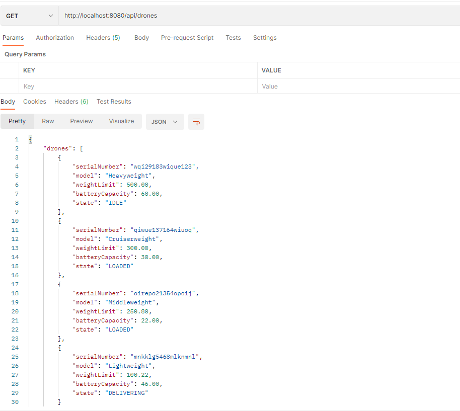
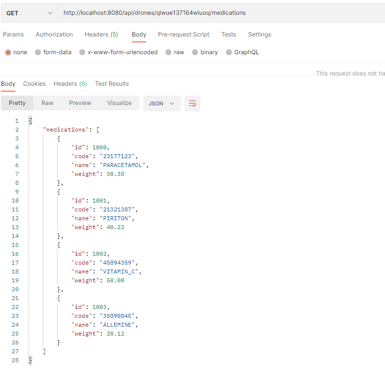
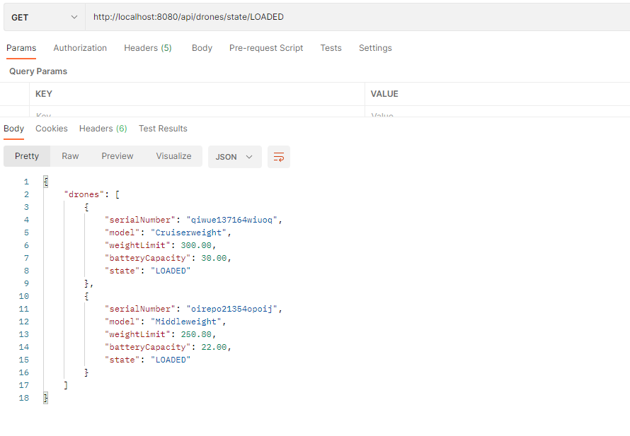
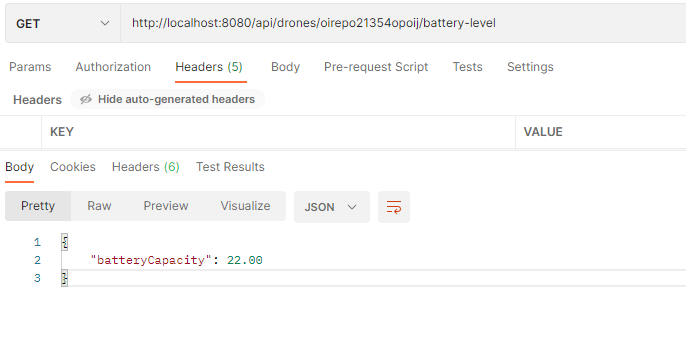
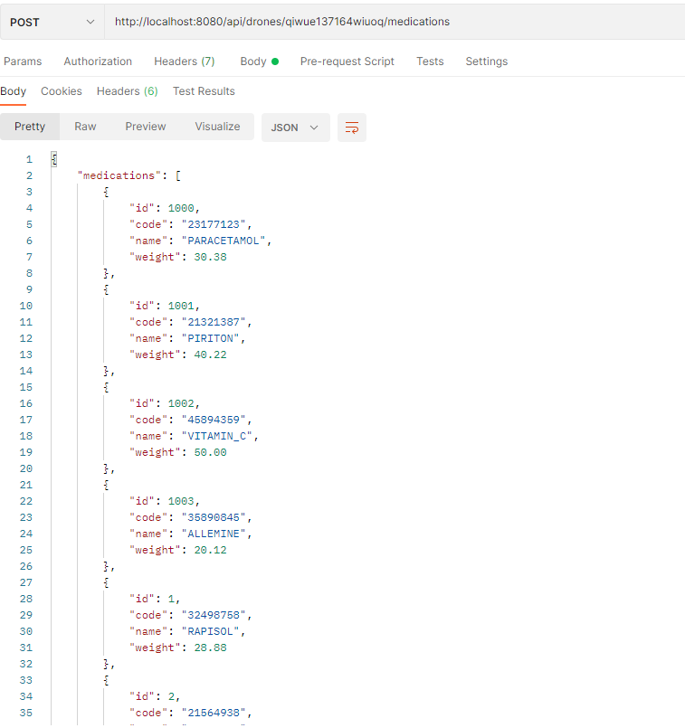
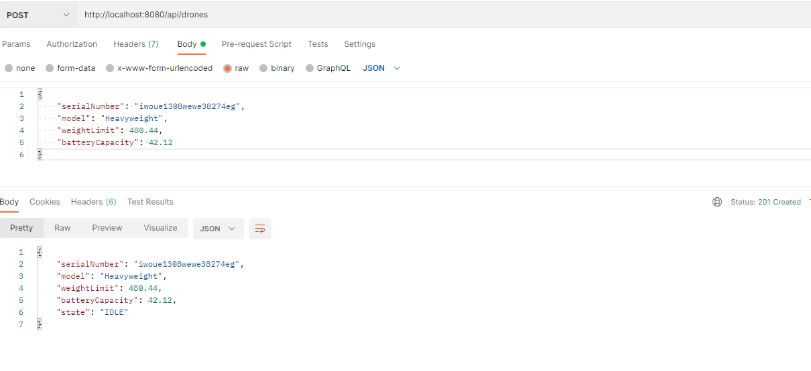
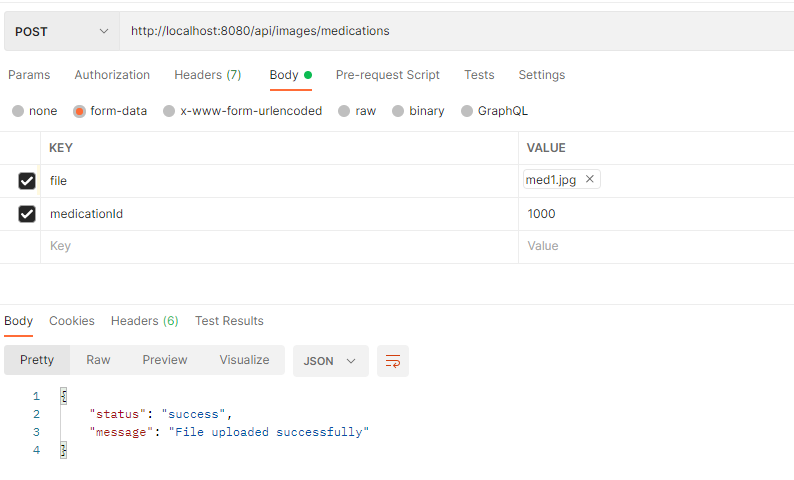
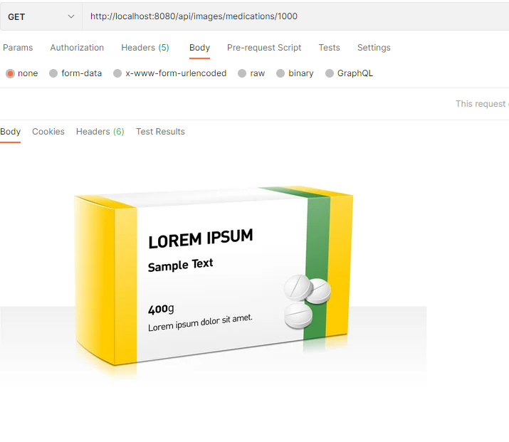
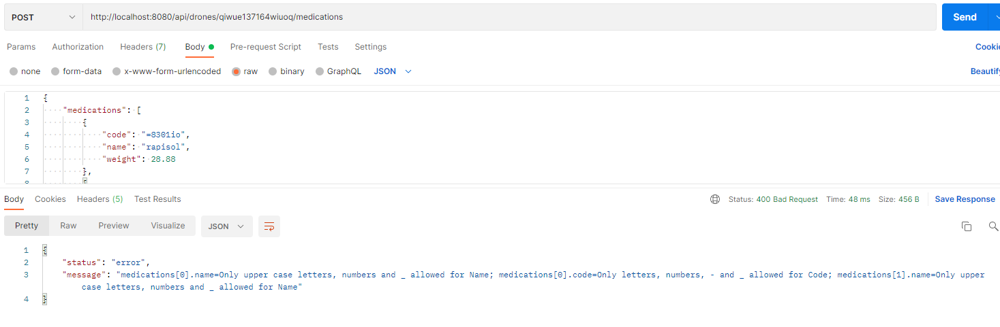
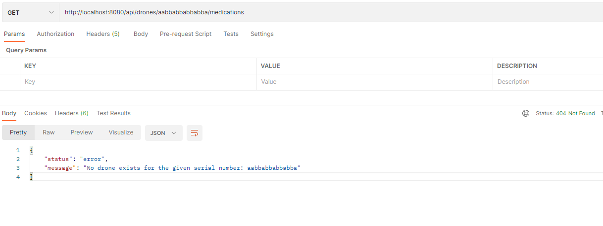

# Drone API

Drones API which allows clients to communicate with Drones.

---
##### Assumptions

- Each Drone has a unique serial number. So serial number is considered as the primary key.
- Auto generated primary key was assigned to each Medication.
- Used in memory H2 database. import.sql script will load some default data.
- Image will be saved in the database as a byte[]. Ideally we have to use a separate storage. I implemented the logic to store/retrieve images from AWS S3 storage, but didn't connect since it required to createAWS resources.

---
##### How to Build and Run

Build 
- Open terminal
- Linux -> ./gradlew build
- Windows -> call gradlew.bat build or .\gradlew.bat build
- build command will execute unit test cases and build the executable jar file

RUN

- Go to build/libs folder
- Execute jar file -> java -jar drones-api-0.0.1.jar
- Application will be up and running in port 8080
- Download postman collection([drones.postman_collection.json](drones.postman_collection.json)) and import into postman.
- Now you can try the sample API calls

Execute Unit test cases only

- Open terminal
- Linux -> ./gradlew test
- Windows -> call gradlew.bat test or .\gradlew.bat test

---
Unit test cases to cover web layer(controller), service logic and validation logic(Please note that unit testing is not complete; we can write more test cases to cover other logics).

---

Images will be saved in database as byte arrays. 2 separate endpoints were implemented to upload and download images. When uploading and downloading images medicationId should be provided.
Please see the api endpoint 07 and 08 for more details.

[ImageServiceS3Impl.java](src%2Fmain%2Fjava%2Fcom%2Fassignment%2Fdrones%2Fservice%2Fimpl%2FImageServiceS3Impl.java) - This class is not connected with any controller or other classed. This is just to showcase image storing, retrieving logic from AWS S3 storage. 

##### API Endpoints

1. Get all drones -> GET http://host:8080/api/drones 

---
2. Get medications loaded in given drone -> GET http://host:8080/api/drones/{serial_number}/medications

---
3. Get drones in the given state -> GET http://host:8080/api/drones/state/{state} IDLE/LOADED/DELIVERED

---
4. Get battery level of the given drone -> GET http://host:8080/api/drones/{serial_number}/battery-level

---
5. Load medications into the given drone -> POST http://host:8080/api/drones/{serial_number}/medications

---
6. Create drone -> POST http://host:8080/api/drones

---
7. Upload medication image -> POST http://host:8080/api/images/medications

---
8. Download image -> GET http://localhost:8080/api/images/medications/{medication_id}

---
9. Validation Errors -> 400 Bad Request

---
10. Entity not found errors -> 404 Not Found

